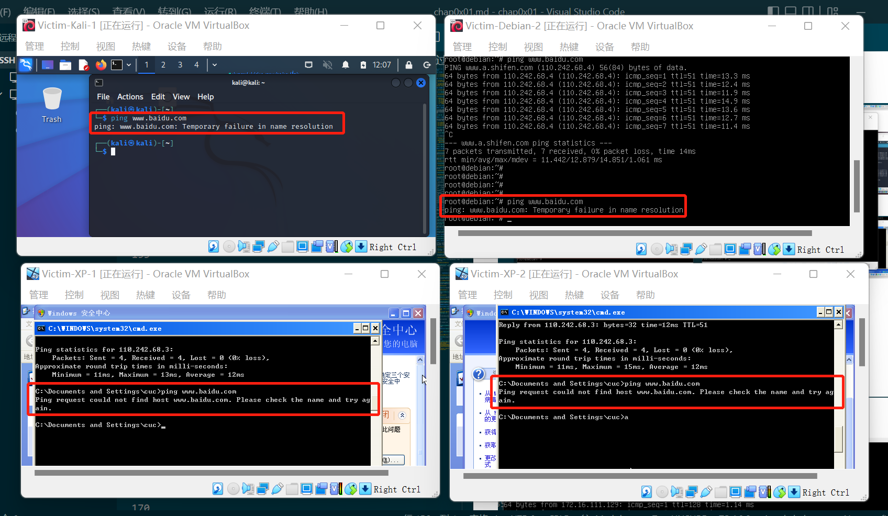

# 实验一：基于 VirtualBox 的网络攻防基础环境搭建

## 实验目的

- 掌握 VirtualBox 虚拟机的安装与使用；
- 掌握 VirtualBox 的虚拟网络类型和按需配置；
- 掌握 VirtualBox 的虚拟硬盘多重加载；

## 实验环境

- VirtualBox 虚拟机
- 攻击者主机（Attacker）：Kali 
- 网关（Gateway）：Debian 
- 靶机（Victim）： xp-sp3 / Kali / Debian

## 实验要求

- 虚拟硬盘配置成多重加载，效果如下图所示


- 搭建满足如下拓扑图所示的虚拟机网络拓扑


- 完成以下网络连通性测试：
  - [x] 靶机可以直接访问攻击者主机
  - [x] 攻击者主机无法直接访问靶机
  - [x] 网关可以直接访问攻击者主机和靶机
  - [x] 靶机的所有对外上下行流量必须经过网关
  - [x] 所有节点均可以访问互联网

## 实验前期准备步骤

#### 1. 将盘片设置为 `多重加载`

在虚拟介质管理器中选中盘片，选择 `多重加载`，（有的时候会提示需要释放，释放之后即可设置成功）在下次新建虚拟机时，可以直接选择已有虚拟硬盘


#### 2. 配置网卡，虚拟机网络拓扑

（1）网关（Debian-Gateway）需要设置共四块网卡，分别配置为：

- 网卡1：NAT网络
- 网卡2：Host-Only网络，方便使用 `ssh`
- 网卡3：内部网络，起名为intnet1，搭建局域网1
- 网卡4：内部网络，起名为intnet2，搭建局域网2


（2）配置攻击者（Kali-Attacker）网卡，设置为 `NAT网络`，使虚拟机可以访问 `Internet`


（3）配置靶机（Victim）网卡，设置为 `内部网络`

- 根据拓扑图，不同的局域网配置不同的网卡
  - `Victim-XP-1` 和 `Victim-Kali-1`属于局域网1，则将二者的网卡应设置为 `intnet1`
  - `Victim-Debian-2` 和 `Victim-XP-2`属于局域网2，则将二者的网卡应设置为 `intnet2`


#### 3. 查看各虚拟机的IP地址

- 网关虚拟机——Debian-Gateway


- 攻击者主机——Kali-Attacker


- 靶机——Victim-XP-1


- 靶机——Victim-Kali-1
  


- 靶机——Victim-XP-2


- 靶机——Victim-Debian-2


<mark>所有虚拟机的IP地址如下：</mark>

| 虚拟机名称      | IP地址 | 
| :---        |    ---: |
| Debian-Gateway      | 10.0.2.15/24（NAT网络）     | 
|      | 192.168.56.113/24 （Host-Only网络）      | 
|     | 172.16.111.1/24 （内部网络intnet1）      | 
|       | 172.16.222.1/24 （内部网络intnet2）      | 
| Kali-Attacker   | 10.0.2.5/24 （NAT网络）       | 
| Victim-XP-1      | 172.16.111.129/24 （内部网络intnet1）   | 
| Victim-Kali-1   | 172.16.111.131/24 （内部网络intnet1）        | 
| Victim-XP-2      |  172.16.222.144/24 （内部网络intnet2）     | 
| Victim-Debian-2   | 172.16.222.146/24 （内部网络intnet2）       | 

## 实验内容及结果（连通性测试）

#### 1. 靶机可以直接访问攻击者主机

各个靶机输入命令，查看能否收到 `Reply`，如果能收到，则说明访问成功

```
ping 10.0.2.5
```


#### 2. 攻击者主机无法直接访问靶机


#### 3. 网关可以直接访问攻击者主机和靶机


#### 4. 靶机的所有对外上下行流量必须经过网关

在网关上安装 `tcpdump`，并对相应的网卡进行监控，在各个节点上访问互联网，观察捕获到了上下行的包。关闭网关，发现所有节点都无法访问互联网，说明靶机上的所有对外上下行流量必须经过网关。

- 在网关 `Debian-Gateway` 上安装 `tcpdump`

```shell
apt update
apt install tcpdump
```

- 对相应的网卡监控：

```shell
/usr/sbin/tcpdump -i enp0s9  
# 对intnet1的监控，对应靶机Victim-XP-1和Victim-Kali-1
/usr/sbin/tcpdump -i enp0s10 
# 对intnet2的监控，对应靶机Victim-XP-2和Victim-Debian-2
```

<mark>关闭网关前</mark>

- 靶机——Victim-XP-1


- 靶机——Victim-Kali-1
  


- 靶机——Victim-XP-2


- 靶机——Victim-Debian-2


<mark>关闭网关后：</mark>



关闭网关后，所有节点都不能访问互联网，则说明靶机上的所有对外上下行流量必须经过网关。

#### 5. 所有节点均可以访问互联网

- 网关虚拟机——Debian-Gateway


- 攻击者主机——Kali-Attacker


- 靶机——Victim-XP-1


- 靶机——Victim-Kali-1
  


- 靶机——Victim-XP-2


- 靶机——Victim-Debian-2


## 遇到的问题及解决方式

#### 问题1：debian不能ssh连接到gitbash

- 问题：最开始想用`gitbash`，但是发现 `ssh`请求一直错误
  
- 解决方法：修改配置，改为图中红框所示内容`PermitRootLogin yes`
  
```shell
vim /etc/ssh/sshd_config
```

然后重新启动ssh连接

```shell
systemctl restart ssh
```


#### 问题2：网关`Debian-Gateway`不能访问`XP`靶机

- 问题：网关`Debian-Gateway` 不能 `ping`通`XP`靶机

- 解决方法：关闭虚拟机`XP`的防火墙


## 参考资料

- [CUCCS/2020-ns-public-LyuLumos](https://github.com/CUCCS/2020-ns-public-LyuLumos/blob/ch0x01/ch0x01/%E5%9F%BA%E4%BA%8E%20VirtualBox%20%E7%9A%84%E7%BD%91%E7%BB%9C%E6%94%BB%E9%98%B2%E5%9F%BA%E7%A1%80%E7%8E%AF%E5%A2%83%E6%90%AD%E5%BB%BA.md)
- [课本](https://c4pr1c3.github.io/cuc-ns/chap0x01/exp.html)