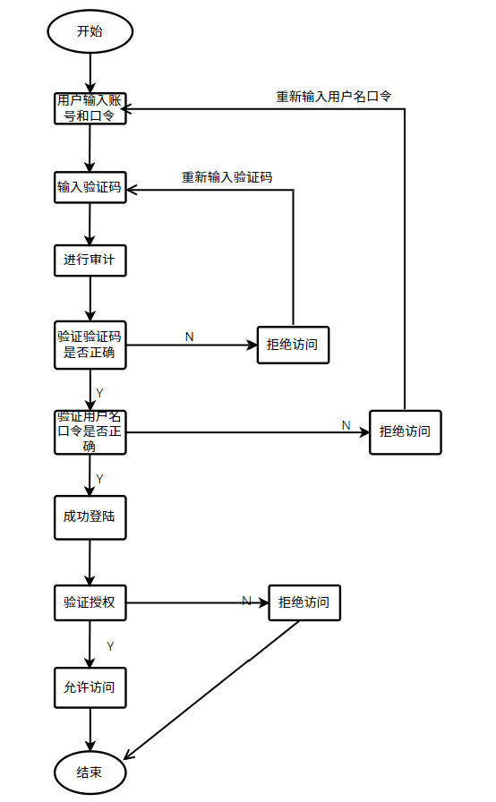
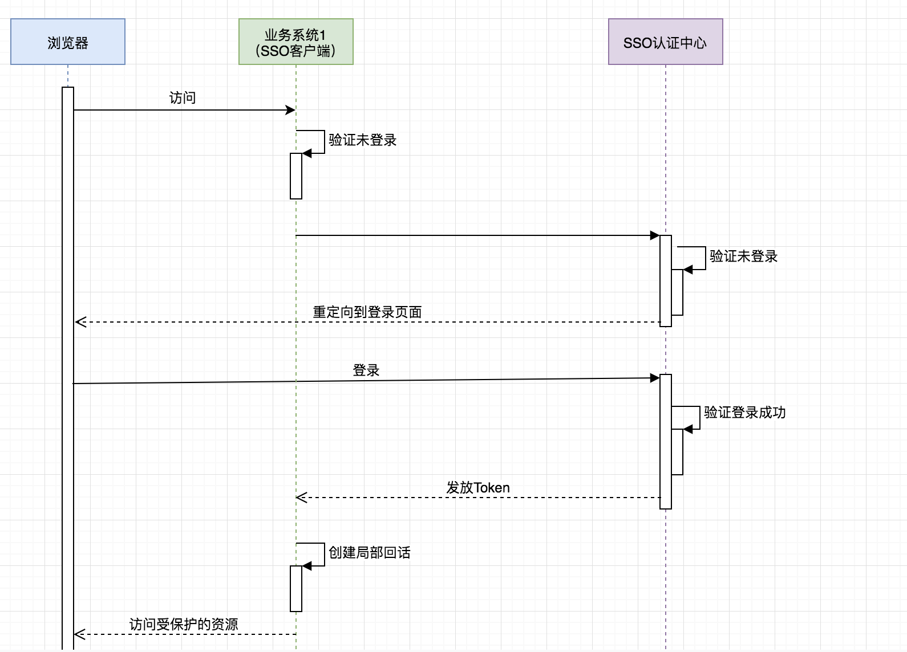

# 实验二：操作系统的访问控制设计实例研究

## 实验目的

- 通过 iOS 或Android 系统为研究对象，进行访问控制的理解和设计

## 实验环境

- 操作系统版本：HarmonOS 2.0.0
- 硬件设备型号：华为nova7
- 是否默认设置：是

## 实验内容

### 一. 操作系统的访问控制设计实例研究

- 以 iOS 和 Android 系统为研究对象
  - 当系统处于锁屏状态下接收到新短信时，不解锁情况下
    - 系统是否允许查看短信内容？
      - **不允许**
    - 系统是否允许回复短信？
      - **不允许**
  - 当系统处于锁屏状态下，使用系统内置（例如 iOS 的 Siri ）或第三方的语音助手可以完成以下哪些操作？
    - 访问通讯录
      - **不可以**
    - 拨打电话
      - **可以**
    - 访问相册
      - **不可以**
    - 查看短信收件箱
      - **不可以**
  - 如果你的手机支持指纹识别解锁手机，请实验并分析指纹识别相比较于简单密码、复杂密码、图形解锁、人脸识别解锁、声纹解锁等解锁方式的安全性、便利性差异。

| 密码类型   | 安全性 | 便利性   |
| :---  |  :----:   |   ---: |
| 简单密码  | 安全性较低，容易被枚举攻击后破解  | 解锁方便   |
| 复杂密码   | 安全性较高   | 解锁不方便，容易遗忘   |
| 图形解锁   | 图形越复杂越安全，但是容易在屏幕上留有痕迹  |  较为便捷  |
| 人脸识别解锁  | 某些方面不安全，比如存在两个极为相似的人（例如双胞胎） | 方便快捷，但是戴着口罩不能识别   |
| 声纹解锁 | 不太安全，声音可以模仿，或者使用变声器  | 较方便  |
| 指纹识别 | 安全性较高，但是容易在屏幕上留有痕迹 | 较方便，但是手指是湿的或者脏的时候无法识别 |

#### 思考题：

- 以上设计实现方式属于我们课堂上讲过的哪种强制访问控制模型？Lattice/BLP？Biba？
  - Biba模型
  - 上读下写
- 系统或第三方应用程序是否提供了上述功能的访问控制规则修改？如果修改默认配置，是提高了安全性还是降低了安全性？
  - 是，不同的第三方程序会申请不同的权限
  - 授权的权限越多越不安全

### 二. 课后题

#### 1. 生物特征身份认证方式有哪些？优缺点分析？应用场景举例。

- **指纹识别**
  - 原理：首先从获取的指纹图像上找到特征点，然后根据特征点的特性建立用户活体指纹的数字表示——指纹特征数据（一种单向的转换，可以从指纹图像转换成特征数据但不能从特征数据转换成为指纹图像）。
  - 优点 
    - 指纹是人体独一无二的特征，可识别性较高
    - 扫描指纹的速度很快，使用方便
    - 指纹采集头可以更加小型化，可降低成本
  - 缺点
    - 某些人或某些群体的指纹因为指纹特征很少，故而很难成像
    - 每一次使用指纹时都会在指纹采集头上留下用户的指纹印痕，存在被复制的可能性
  - 应用场景举例
    - 刑侦破案、电子设备（手机、iPad、电脑）指纹解锁、指纹门锁

- **声音识别**
  - 原理：
    - 用电声学仪器显示携带言语信息的声波频谱
  - 优点：
    - 蕴含声纹特征的语音获取方便、自然
    - 获取语音的识别成本低廉，使用简单
    - 适合远程身份确认，只需要一个麦克风或电话、手机就可以通过网路（通讯网络或互联网络）实现远程登录
    - 声纹辨认和确认的算法复杂度低
    - 配合一些其他措施，如通过语音识别进行内容鉴别等，可以提高准确率
  - 缺点：
    - 同一个人的声音具有易变性，易受身体状况、年龄、情绪等的影响
    - 不同的麦克风和信道对识别性能有影响
    - 环境噪音对识别有干扰
    - 混合说话人的情形下人的声纹特征不易提取

- **视网膜识别**
  - 原理
    - 视网膜是眼睛底部的血液细胞层。视网膜扫描是采用低密度的红外线去捕捉视网膜的独特特征，血液细胞的唯一模式就因此被捕捉下来
  - 优点 
    - 视网膜不易磨损、老化或是被疾病影响
    - 使用者不需要和设备直接接触
    - 被伪造的可能性低
  - 缺点
    - 未经过任何测试
    - 可能会给使用者带来健康损坏
    - 成本较高

- **虹膜识别**
  - 原理
    - 捕捉虹膜的数据图像，为虹膜的图像分析准备过程，从虹膜的纹理或类型创造512字节的iriscode，使用iriscode模板用于确认
  - 优点：
    - 便于用户使用
    - 可靠性高
    - 不需物理的接触
    - 快捷方便
    - 授权灵活
  - 缺点
    - 很难将图像获取设备的尺寸小型化
    - 设备造价高，无法大范围推广
    - 镜头可能产生图像畸变而使可靠性降低

- **面部识别**
  - 原理：
    - 利用计算机图像处理技术从视频中提取人像特征点，利用生物统计学的原理进行分析建立数学模型，即人脸特征模板。利用已建成的人脸特征模板与被测者的面像进行特征分析，根据分析的结果来给出一个相似值。通过这个值即可确定是否为同一人。
  - 优点：
    - 使用方便
    - 识别精确度高，速度快
    - 成本较低，易于推广
  - 缺点
    - 面部外形不稳定，易变性较高

- **静脉识别**
  - 原理
    - 利用静脉血管的结构来进行身份识别
  - 优点   
    - 属于内部生理特征，不会磨损，较难伪造，具有很高安全性
    - 血管特征通常更明显，容易辨识，抗干扰性好
    - 可实现非接触式测量，卫生性好，易于被用户接受
    - 不易受手表面伤痕或油污的影响
  - 缺点
    - 手背静脉仍可能随着年龄和生理的变化而发生变化，永久性尚未得到证实
    - 仍然存在无法成功注册登记的可能
    - 采集方式受自身特点的限制，产品难以小型化
    - 采集设备有特殊要求，设计相对复杂，制造成本高

#### 2. “找回口令功能”和“忘记密码”在访问授权机制中的意义？请尝试设计几种安全的“找回口令功能”，详细描述找回口令的用户具体操作过程。

- 意义
  - 帮助遗忘密码用户重新找回密码，使得用户可以重新登陆
- 具体操作过程
  - 点击 “忘记密码” 按钮之后，可跳转到发送验证码，可选择发邮箱或发短信，将收到的验证码填入对应位置，即可重新设置密码，然后使用新的密码重新登陆。

#### 3. 绘制用户使用用户名/口令+图片验证码方式录系统的流程图。考虑认证成功和失败两种场景，考虑授权成功和失败两种场景。

#### 4. Windows XP / 7 中的访问控制策略有哪些？访问控制机制有哪些？

- 访问控制策略
  - 基于规则的访问控制策略
  - 基于身份的访问控制策略
  - 基于上述两种策略的组合
- 访问控制机制
  - 访问令牌（包含关于登陆用户的信息）
  - 安全描述符（包含用于保护一个安全对象的安全信息）

#### 5. 用权限三角形模型来理解并描述下 2 种威胁模型：提权、仿冒。

- 提权
  - 含义：提高自己在服务器中的权限，主要针对网站入侵过程中，当入侵某一网站时，通过各种漏洞提升WEBSHELL权限以夺得该服务器权限
  - 例如：在Windows中，你本身登陆的用户是guest，然后通过提权后变成了超级管理员，拥有了管理Windows的所有权限
  - 用途：黑客的专业名词，一把用于网站入侵和系统入侵
- 仿冒
  - 含义：用户A冒充用户B，取得了用户B的权限
  - 用户在系统看来角色进行了变更，相对应的权力因而发生了变化

#### 6. 试通过操作系统的访问控制机制来达到预防一种真实病毒的运行目的。

- 终端自身不安全————安装防火墙与杀毒软件
- 系统内不安全————进行身份认证
- 网络不安全————安装网闸与VPN

#### 7. 什么是 OAuth？

- 定义：
  - OAuth是一个关于授权（authorization）的开放网络标准，在全世界得到广泛应用
- 原理/思路：
  - OAuth在"客户端"与"服务提供商"之间，设置了一个授权层（authorization layer）。"客户端"不能直接登录"服务提供商"，只能登录授权层，以此将用户与客户端区分开来。"客户端"登录授权层所用的令牌（token），与用户的密码不同。用户可以在登录的时候，指定授权层令牌的权限范围和有效期。
  - "客户端"登录授权层以后，"服务提供商"根据令牌的权限范围和有效期，向"客户端"开放用户储存的资料。
- 运行流程
  - 用户打开客户端以后，客户端要求用户给予授权
  - 用户同意给予客户端授权
  - 客户端使用上一步获得的授权，向认证服务器申请令牌
  - 认证服务器对客户端进行认证以后，确认无误，同意发放令牌
  - 客户端使用令牌，向资源服务器申请获取资源
  - 资源服务器确认令牌无误，同意向客户端开放资源
- 客户端的授权模式
  - 授权码模式
  - 简化模式
  - 密码模式
  - 客户端模式

#### 8. 什么是 OpenID？

OpenID是一个去中心化的网上身份认证系统。对于支持OpenID的网站，用户不需要记住像用户名和密码这样的传统验证标记。取而代之的是，他们只需要预先在一个作为OpenID身份提供者（identity provider, IdP）的网站上注册。OpenID是去中心化的，任何网站都可以使用OpenID来作为用户登录的一种方式，任何网站也都可以作为OpenID身份提供者。OpenID既解决了问题而又不需要依赖于中心性的网站来确认数字身份。

#### 9. 试用本章所学理论分析 0Auth 和 OpenID 的区别与联系。

- OpenID是网站对用户进行认证，让网站知道“你是你所声称的URL的属主”
- 0Auth其实并不包括认证，只不过“只有认证成功的人才能进行授权”，结果类似于“认证+授权”了。OAuth相当于：A网站给B网站一个令牌，然后告诉B网站说根据这个令牌你可以获取到某用户在A网站上允许你访问的所有信息

#### 10. 如何使用 OAuth 和 OpenID 相关技术实现单点登录（Single Sign On）？

- 什么是单点登录
  - 单点登录 Single Sign On，简称为SSO。
  - 用途
    - 不管多么复杂的应用群，只要在用户权限范围内，那么就可以做到，用户只需要登录一次就可以访问权限范围内的所有应用子系统。
    - 对于用户而言，访问多个应用子系统只需要登录一次，同样在需要注销的时候也只需要注销一次。
  - 举个简单的例子，你在百度首页登录成功之后，你再访问百度百科、百度知道、百度贴吧等网站也会处于登录状态了，这就是一个单点登录的真实案例。
  - 重要理解：
    - SSO服务端和SSO客户端直接是通过授权以后发放Token的形式来访问受保护的资源
    - 相对于浏览器来说，业务系统是服务端，相对于SSO服务端来说，业务系统是客户端
    - 浏览器和业务系统之间通过会话正常访问
    - 不是每次浏览器请求都要去SSO服务端去验证，只要浏览器和它所访问的服务端的会话有效它就可以正常访问

- OAuth认证流程
  - 用户首先要保持登录，即已认证通过的状态
  - 第三方应用请求用户授权
  - 用户授权成功之后会向认证服务器请求授权码,请求中还会携带跳转至第三方应用的链接
  - 获得授权码之后用户所在的浏览器网页将跳转到第三方应用
  - 第三方应用携带授权码和应用认证信息到认证服务器换取授权码
  - 第三方应用就可以在访问开放平台时带上授权码

- OpenID配置单点登录
  - 用户尝试通过 Web 浏览器访问产品中的服务
  - 您的产品将验证是否存在认证令牌
  - 如果不存在认证令牌，那么产品会将认证请求重定向到用户的第三方授权服务器
  - 授权服务器向用户提供登录页面
  - 如果用户成功登录，那么授权服务器会将用户以及 OIDC 响应重定向到您的产品
  - 您的产品将生成认证令牌并授予对用户请求的服务的访问权

### 参考资料

- [生物特征识别](https://www.sohu.com/a/227976900_297710)
- [提权](https://baike.baidu.com/item/%E6%8F%90%E6%9D%83/2513827#:~:text=%E6%8F%90%E6%9D%83%EF%BC%8C%E9%A1%BE%E5%90%8D%E6%80%9D%E4%B9%89%E5%B0%B1%E6%98%AF%E6%8F%90%E9%AB%98,%E5%85%A5%E4%BE%B5%E5%92%8C%E7%B3%BB%E7%BB%9F%E5%85%A5%E4%BE%B5%E4%B8%AD%E3%80%82)
- [OAuth](https://www.ruanyifeng.com/blog/2014/05/oauth_2_0.html)
- [OpenID](https://baike.baidu.com/item/OpenID/2267230)
- [单点登录](https://blog.csdn.net/weixin_40482816/article/details/114133202)
- [OAuth认证实现机制及单点登录原理](https://segmentfault.com/a/1190000005357718)
- [使用 OpenID Connect (OIDC) 配置单点登录](https://www.ibm.com/docs/zh/cpfs?topic=users-configuring-single-sign-using-openid-connect)