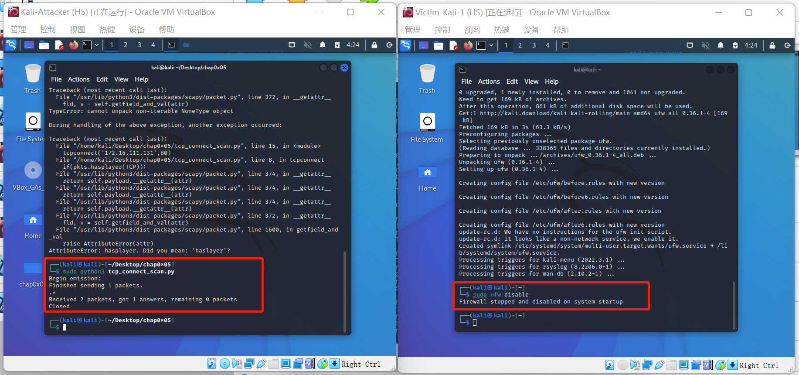

# 实验五：基于 Scapy 编写端口扫描器

## 实验目的

- 掌握网络扫描之端口状态探测的基本原理

## 实验环境

- VirtualBox 6.1
- 攻击者主机（Attacker）：Kali 
- 网关（Gateway）：Debian 
- 靶机（Victim）：Kali 
- python + scapy

## 实验要求

- 禁止探测互联网上的 IP ，严格遵守网络安全相关法律法规
- 完成以下扫描技术的编程实现
  - `TCP connect scan` / `TCP stealth scan`
  - `TCP Xmas scan` / `TCP fin scan` / `TCP null scan`
  - `UDP scan`
- 上述每种扫描技术的实现测试均需要测试端口状态为：`开放`、`关闭` 和 `过滤` 状态时的程序执行结果
- 提供每一次扫描测试的抓包结果并分析与课本中的扫描方法原理是否相符？如果不同，试分析原因；
- 在实验报告中详细说明实验网络环境拓扑、被测试 IP 的端口状态是如何模拟的
- （可选）复刻 nmap 的上述扫描技术实现的命令行参数开关

## 实验过程

### 网络拓扑


使用类似第四章实验的拓扑结构，Attacker作为扫描端，Victim作为被扫描的靶机。

### 端口状态模拟

- 查看当前防火墙的状态和现有规则

```shell
ufw status
```

- 关闭状态：对于端口没有开启监听，防火墙没有开启

```shell
ufw disable
```

- 开启状态：对应端口开启监听，防火墙处于关闭状态
  - apahce2基于TCP，在80端口提供服务
  - DNS服务基于UDP，在53端口提供服务

```shell
systemctl start apache2 # port 80
systemctl start dnsmasq # port 53
```

- 过滤状态：对应端口开启监听，防火墙开启

```shell
ufw enable && ufw deny 80/tcp
ufw enable && ufw deny 53/udp
```

首先扫描一下局域网内有多少存活主机IP，使用以下命令：

```
nmap -sn 172.16.111.0/24
```


根据结果可知，该局域网内共有三台存活主机，分别为网关、攻击者主机（本机）、受害者主机

#### TCP connect scan

-  原理：

首先发送一个 `SYN` 数据包（S）到目标主机的特定端口上，等待回应。

如果接收到的是一个 RST/ACK 数据包 (RA) ，通常意味着端口是关闭的并且链接将会被重置。

如果接收到的是一个 SYN/ACK 数据包（SA），则说明端口是开放状态的，便发送一个 ACK 确认包到目标主机，这样便完成了三次握手连接机制。成功后再终止连接。

- code

```python
from scapy.all import *

def tcpconnect(dst_ip, dst_port, timeout=10):
    pkts = sr1(IP(dst=dst_ip)/TCP(dport=dst_port,flags="S"),timeout=timeout)
    if pkts is None:
        print("Filtered")
    elif(pkts.haslayer(TCP)):
        if(pkts.hasplayer(TCP)):
            if(pkts.getlayer(TCP).flags == 0x12): #Flags: 0x012 (SYN, ACK)
                send_rst = sr(IP(dst=dst_ip)/TCP(dport=dst_port,falgs="AR"),timeout=timeout)
                print("Open")
            elif(pkts.getlayer(TCP).flags == 0x14): #Flags: 0x014 (RST, ACK)
                print("Closed")

tcpconnect('172.16.111.131',80)
```

##### 端口关闭

- 使用scapy

```shell
sudo ufw disable
```




扫描主机发出 `SYN` 数据包，受到来自被扫描主机的 `RST/ACK` 数据包，说明端口关闭。

- nmap复刻

```shell
nmap -sT -p 80 172.16.111.131
```


##### 端口开放

- 使用scapy

```shell
sudo ufw enable && sudo ufw allow 80/tcp
```


扫描主机发出 `SYN` 数据包，受到来自被扫描主机的 `SYN/ACK` 数据包，说明端口是开放状态的。

- nmap复刻


##### 端口过滤

- 使用scapy

```shell
sudo ufw enable && sudo ufw deny 80/tcp
```


只有一个TCP数据包，说明端口处于过滤状态。

- nmap复刻

```shell
nmap -sT -p 80 172.16.111.131
```


#### TCP stealth scan

- 原理

先发送一个S，然后等待回应。如果有回应且标识为RA，说明目标端口处于关闭状态；如果有回应且标识为SA，说明目标端口处于开放状态。这时TCP stealth scan只回复一个R，不完成三次握手，直接取消建立连接。

- code

```python
from scapy.all import *


def tcpstealthscan(dst_ip, dst_port, timeout=10):
    pkts = sr1(IP(dst=dst_ip)/TCP(dport=dst_port, flags="S"), timeout=10)
    if (pkts is None):
        print("Filtered")
    elif(pkts.haslayer(TCP)):
        if(pkts.getlayer(TCP).flags == 0x12):
            send_rst = sr(IP(dst=dst_ip) /
                          TCP(dport=dst_port, flags="R"), timeout=10)
            print("Open")
        elif (pkts.getlayer(TCP).flags == 0x14):
            print("Closed")
        elif(pkts.haslayer(ICMP)):
            if(int(pkts.getlayer(ICMP).type) == 3 and int(stealth_scan_resp.getlayer(ICMP).code) in [1, 2, 3, 9, 10, 13]):
                print("Filtered")


tcpstealthscan('172.16.111.131', 80)
```

##### 端口关闭

- 使用scapy

```shell
sudo ufw disable
```


扫描主机先发送一个 SYN数据包，收到来自被扫描主机的 RST/ACK 数据包，说明目标端口处于关闭状态。

- nmap复刻


##### 端口开放

- 使用scapy

```shell
sudo ufw enable && sudo ufw allow 80/tcp
```


扫描主机先发送一个 SYN数据包，收到来自被扫描主机的 SYN/ACK 数据包，说明目标端口处于开放状态。这时TCP stealth scan只回复一个RST数据包，不完成三次握手，直接取消建立连接。

- nmap复刻


##### 端口过滤

- 使用scapy

```shell
sudo ufw enable && sudo ufw deny 80/tcp
```


- nmap复刻


#### TCP Xmas scan

- 原理

一种隐蔽性扫描，当处于端口处于关闭状态时，会回复一个RST包；其余所有状态都将不回复。

- code

```python
from scapy.all import *

def Xmasscan(dst_ip, dst_port, timeout=10):
    pkts = sr1(IP(dst=dst_ip)/TCP(dport=dst_port, flags="FPU"), timeout=10)
    if (pkts is None):
        print("Open|Filtered")
    elif(pkts.haslayer(TCP)):
        if(pkts.getlayer(TCP).flags == 0x14):
            print("Closed")
    elif(pkts.haslayer(ICMP)):
        if(int(pkts.getlayer(ICMP).type) == 3 and int(pkts.getlayer(ICMP).code) in [1, 2, 3, 9, 10, 13]):
            print("Filtered")

Xmasscan('172.16.111.131', 80)
```

##### 端口关闭

- 使用scapy


- nmap复刻


##### 端口开放

- 使用scapy


- nmap复刻


##### 端口过滤

- 使用scapy

```shell
sudo ufw enable && sudo ufw deny 80/tcp
```


- nmap复刻


#### TCP FIN scan

- 原理

仅发送FIN包，FIN数据包能够通过只监测SYN包的包过滤器，隐蔽性较SYN扫描更高，此扫描与Xmas扫描也较为相似，只是发送的包为FIN包，同理，收到RST包说明端口处于关闭状态；反之说明为开启/过滤状态。

- code

```python
from scapy.all import *

def finscan(dst_ip, dst_port, timeout=10):
    pkts = sr1(IP(dst=dst_ip)/TCP(dport=dst_port, flags="F"), timeout=10)
    if (pkts is None):
        print("Open|Filtered")
    elif(pkts.haslayer(TCP)):
        if(pkts.getlayer(TCP).flags == 0x14):
            print("Closed")
    elif(pkts.haslayer(ICMP)):
        if(int(pkts.getlayer(ICMP).type) == 3 and int(pkts.getlayer(ICMP).code) in [1, 2, 3, 9, 10, 13]):
            print("Filtered")

finscan('172.16.111.131', 80)
```

##### 端口关闭

- 使用scapy


- nmap复刻


##### 端口开放

- 使用scapy


靶机只收到了一个TCP包且没有响应，说明靶机端口处于过滤或开启状态，与预期相符合

- nmap复刻


##### 端口过滤

- 使用scapy


- nmap复刻


#### TCP NULL scan

- 原理

发送的包中关闭所有TCP报文头标记，实验结果预期还是同理：收到RST包说明端口为关闭状态，未收到包即为开启/过滤状态.

- code

```python
from scapy.all import *

def nullscan(dst_ip, dst_port, timeout=10):
    pkts = sr1(IP(dst=dst_ip)/TCP(dport=dst_port, flags=""), timeout=10)
    if (pkts is None):
        print("Open|Filtered")
    elif(pkts.haslayer(TCP)):
        if(pkts.getlayer(TCP).flags == 0x14):
            print("Closed")
    elif(pkts.haslayer(ICMP)):
        if(int(pkts.getlayer(ICMP).type) == 3 and int(pkts.getlayer(ICMP).code) in [1, 2, 3, 9, 10, 13]):
            print("Filtered")

nullscan('172.16.111.131', 80)
```

##### 端口关闭

- 使用scapy


- nmap复刻


##### 端口开放

- 使用scapy


- nmap复刻


##### 端口过滤

- 使用scapy


- nmap复刻


#### UDP scan

- 原理

一种开放式扫描，通过发送UDP包进行扫描。当收到UDP回复时，该端口为开启状态；否则即为关闭/过滤状态。

- code

```python
from scapy.all import *

def udpscan(dst_ip, dst_port, dst_timeout=10):
    resp = sr1(IP(dst=dst_ip)/UDP(dport=dst_port), timeout=dst_timeout)
    if (resp is None):
        print("Open|Filtered")
    elif (resp.haslayer(UDP)):
        print("Open")
    elif(resp.haslayer(ICMP)):
        if(int(resp.getlayer(ICMP).type) == 3 and int(resp.getlayer(ICMP).code) == 3):
            print("Closed")
        elif(int(resp.getlayer(ICMP).type) == 3 and int(resp.getlayer(ICMP).code) in [1, 2, 9, 10, 13]):
            print("Filtered")
        elif(resp.haslayer(IP) and resp.getlayer(IP).proto == IP_PROTOS.udp):
            print("Open")

udpscan('172.16.111.131', 80)
```

##### 端口关闭

- 使用scapy


- nmap复刻


##### 端口开放

- 使用scapy


- nmap复刻


##### 端口过滤

- 使用scapy


- nmap复刻


## 遇到的问题及解决方式

- 问题：安装 `ufw` 失败，报错如下;

```shell
E: Package ‘ufw’ has no installation candidate
```

- 解决方式

```shell
sudo apt update
sudo apt install ufw
```


## 总结

1. 扫描方式与端口状态的对应关系

   | 扫描方式/端口状态             | 开放                            | 关闭            | 过滤            |
   | ----------------------------- | ------------------------------- | --------------- | --------------- |
   | TCP connect / TCP stealth     | 完整的三次握手，能抓到ACK&RST包 | 只收到一个RST包 | 收不到任何TCP包 |
   | TCP Xmas / TCP FIN / TCP NULL | 收不到TCP回复包                 | 收到一个RST包   | 收不到TCP回复包 |
   | UDP                           | 收到UDP回复包                   | 收不到UDP回复包 | 收不到UDP回复包 |

2. 提供每一次扫描测试的抓包结果并分析与课本中的扫描方法原理是否相符？如果不同，试分析原因。

   **完全一致**

## 参考资料

- [黄大课本——第五章：基于 Scapy 编写端口扫描器](https://c4pr1c3.github.io/cuc-ns/chap0x05/main.html)
- [2020-ns-public-LyuLumos](https://github.com/CUCCS/2020-ns-public-LyuLumos/blob/ch0x05/ch0x05/README.md)
- [Port scanning using Scapy](https://resources.infosecinstitute.com/topic/port-scanning-using-scapy/)
- [E: Package ‘ufw’ has no installation candidate on Debian Linux](https://www.nixcraft.com/t/e-package-ufw-has-no-installation-candidate-on-debian-linux/3726)